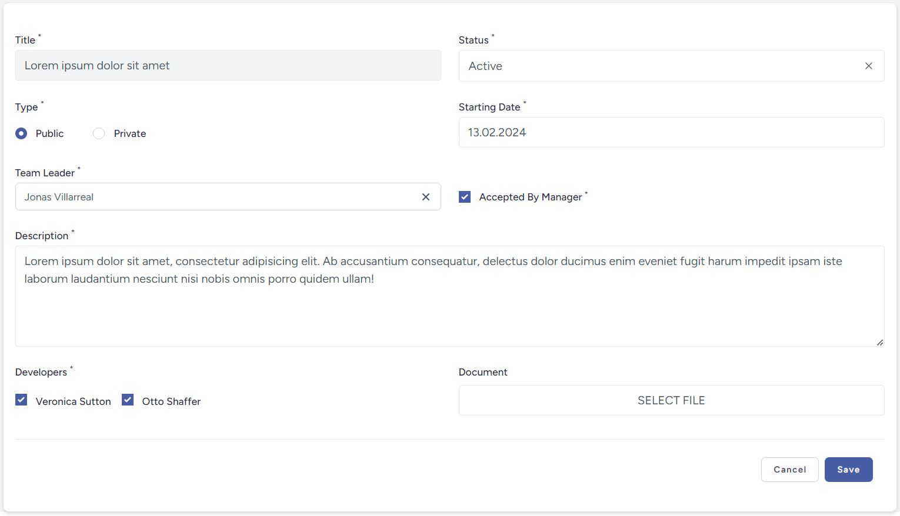

<h1 align="center">lara-forms-builder package</h1>

[](https://packagist.org/packages/wisam-alhennawi/lara-forms-builder)
[](https://github.com/wisam-alhennawi/lara-forms-builder/actions?query=workflow%3Arun-tests+branch%3Amain)
[](https://github.com/wisam-alhennawi/lara-forms-builder/actions?query=workflow%3A"Fix+PHP+code+style+issues"+branch%3Amain)
[](https://packagist.org/packages/wisam-alhennawi/lara-forms-builder)

## About
The main functionality of this package is:
- Generate Livewire forms (Show, Create, Update) by using one command and one Livewire component.

## Requirements
The following dependencies are required to use the package:

| Dependency  | Version                                             |     |
|:------------|:----------------------------------------------------|:----|
| PHP         | [8.x](https://www.php.net/releases/8.0/en.php)      |     |
| Laravel     | [10.x](https://laravel.com/docs/10.x)               |     |
| Jetstream   | [4.x](https://jetstream.laravel.com/)               | 💡  |
| Livewire    | [3.x](https://livewire.laravel.com/docs/quickstart) | 💡  |
| Alpine.js   | [3.x](https://alpinejs.dev/)                        | 💡  |
| TailwindCSS | [3.x](https://tailwindcss.com/docs)                 | 💡  |
| Pikaday     | [1.x](https://github.com/Pikaday/Pikaday)           | 💡  |
| Moment      | [2.x](https://momentjs.com/docs/)                   | 💡  |

💡 => You can install it with Auto Setup & Configuration.
> Note that (pikaday & moment) npm packages is required only if you have a date field within your form.

## Installation

```bash
composer require wisam-alhennawi/lara-forms-builder
```

## Auto Setup & Configuration
```bash
php artisan make:lara-forms-builder-setup
```

This command will do the following:
- Install `"laravel/jetstream": "^4.0"` with `"livewire/livewire": "^3.0"` if not installed. Installing jetstream will install `"tailwindcss": "^3.0"` & `"alpinejs": "^3.0"`.
- Install `"pikaday": "^1.0"` and `"moment": "^2.0"` npm packages and make required configuration.
- Add confirmation modal component to `app.blade.php` layout.
- publish `lara-forms-builder.php` config file and make required configuration.
- publish `lara-forms-builder.css` assets file and make required configuration.
- Run `npm install` & `npm run build`.

## Configuration

### Publishing Assets

1) #### Config **(Mandatory)**
    You Must publish the config file and add it to the `tailwind.config.js` in order to apply the styles:
    ```bash
    php artisan vendor:publish --tag="lara-forms-builder-config"
    ```
    This is the contents of the published config file:
    ```php
    return [
        'default_group_wrapper_class' => 'lfb-group-wrapper',
        'default_field_wrapper_class' => 'lfb-field-wrapper',
        'card_field_error_wrapper_classes' => 'shadow mb-4 overflow-hidden rounded-md col-span-2 sm:col-span-2',
        'primary_button_classes' => 'lfb-primary-button',
        'secondary_button_classes' => 'lfb-secondary-button',
        'footer_buttons_wrapper_classes' => 'lfb-buttons-wrapper',
        'previous_button_classes' => 'lfb-secondary-button',
        'next_button_classes' => 'lfb-primary-button',
    ];
    ```

   Update `tailwind.config.js`:
   ```js
   export default {
        content: [
        './config/lara-forms-builder.php',
       ],
        theme: {
            extend: {
                colors: {
                    'primary': '', // #7c8e63
                    'secondary': '', // #aebf85
                    'danger': '' // #DC3545
                },
            },
        },
   };
   ```

2) #### CSS **(Mandatory)**
   Publishing css file is **Mandatory** to apply styles.

    ```bash
    php artisan vendor:publish --tag="lara-forms-builder-assets"
    ```
   That will make a new css file `lara-forms-builder.css` in the `public/vendor/lara-forms-builder/css/` directory.
   After that you must import this file with your `resources/css/app.css` by adding:
    ```bash
    @import "../../public/vendor/lara-forms-builder/css/lara-forms-builder.css";
    ```
   And feel free to edit the default style in `lara-forms-builder.css` to fulfil your form requirements style.

3) #### Translation (optional)
    ```bash
    php artisan vendor:publish --tag="lara-forms-builder-translations"
    ```

4) #### Views (optional)
    ```bash
    php artisan vendor:publish --tag="lara-forms-builder-views"
    ```

### Using date in form (optional)
Like it mention in the Requirements section if your form has a date field you must install required dependencies by following these steps:
- Installing pikaday:
    ```bash
    npm install pikaday
    ```
  add these to your `resources/js/app.js`
    ```js
    import Pikaday from 'pikaday';
    window.Pikaday = Pikaday;
    ```
  add these to your `resources/css/app.css`
    ```css
    @import 'pikaday/css/pikaday.css';
    ```

- Installing moment:
    ```bash
    npm install moment
    ```
### Use confirmation modal

In order to use the confirmation modal within your project you must include it globally in the default layout of your blade view where you want to use it.
So you can add `@livewire('modals.confirmation')` to your `views/layouts/app.blade.php` inside the html `<body>` tag.

## Usage

### Create new Livewire from

By using this command you can create a new Livewire form depending on a model,
additionally you can add [--langModelFileName=] tag to specify a lang file for model fields labels:
```bash
php artisan make:lara-forms-builder name model --langModelFileName=
```

Examples:
```bash
php artisan make:lara-forms-builder UserForm User --langModelFileName=users
php artisan make:lara-forms-builder Users.UserForm User --langModelFileName=users       //this will make a UserForm component inside Users directory.
```

### Form Component Types and Attributes

Forms are specified in a declarative manner as an array of the `fields` function in the form component class.
`beforeFormProperties()`, `afterFormProperties()` functions used to set options, values, etc. before/after setting the form properties (e.g. developers options in the following example).
`saveDevelopers()` function used to make operation after create/update a model (e.g. developers ids & project id will be saved in pivot table in the following example).
**Note:** `saveDevelopers()`functions should follow the naming convention of the form field name `developers`.


```php

public array $developersOptions = []; // For 'checkbox-group' options
public array $userIdOptions = []; // For 'user_id' options
    
public function beforeFormProperties(): void
{
    $this->developersOptions = User::all(['id as value', 'name as label'])->toArray();
}

public function afterFormProperties(): void
{
    $this->formProperties['developers'] = $this->model->developers->pluck('id');
}
    
protected function fields(): array
    {
        return [
            [
                'fields' => [
                    'title' => [
                        'type' => 'input',
                        'label' => __('models/projects.fields.title'),
                        'readOnly' => true
                    ],
                    'status' => [
                        'type' => 'select',
                        'label' => __('models/projects.fields.status'),
                        'styled' => true,
                        'searchable' => true,
                        'options' => [
                            [
                                'value' => '1',
                                'label' => __('Pending')
                            ],
                            [
                                'value' => '2',
                                'label' => __('Active')
                            ],
                            [
                                'value' => '3',
                                'label' => __('Completed')
                            ]
                        ]
                    ],
                    'type' => [
                        'type' => 'radio',
                        'label' => __('models/projects.fields.type'),
                        'options' => [
                            '1' => __('Public'),
                            '2' => __('Private')
                        ]
                    ],
                    'starting_date' => [
                        'type' => 'date-picker',
                        'label' => __('models/projects.fields.starting_date'),
                    ],
                    'user_id' => [
                        'type' => 'search-picker',
                        'label' => __('models/projects.fields.user_id'),
                        'searchPickerResultsProperty' => 'userIdOptions',
                        'placeholder' => __('Search for Team Leader'),
                    ],
                    'is_accepted' => [
                        'type' => 'checkbox',
                        'label' => __('models/projects.fields.is_accepted'),
                    ],
                    'description' => [
                        'type' => 'textarea',
                        'label' => __('models/projects.fields.description'),
                        'field_wrapper_class' => 'col-span-2',
                    ],
                    'developers' => [
                        'type' => 'checkbox-group',
                        'label' => __('models/projects.fields.developers'),
                        'options' => $this->developersOptions,
                        'default' => []
                    ],
                    'document' => [
                        'type' => 'file',
                        'label' => __('models/projects.fields.document'),
                    ],
                ]
            ]
        ];
    }

public function saveDevelopers($validated_date) {
    $this->model->developers()->sync($validated_date);
}

public function getUserIdOptions($searchPickerTerm)
{
    return User::select('id', 'name')
        ->where('name', 'like', '%' . $searchPickerTerm . '%')
        ->get()
        ->each(function($row){
            $row->key = $row->id;
            $row->value = $row->name;
            $row->labels = collect(['White', 'Green', 'Blue', 'Red', 'Yellow'])->random(rand(0, 3))->toArray();
        })
        ->toArray();
}

// will return ($user_id_search_picker_selected_value) which used in blade to display the selected option
public function getUserIdSearchPickerSelectedValueProperty()
{
    if ($this->formProperties['user_id']) {
        return User::find($this->formProperties['user_id'])->name;
    }
    return null;
}

```

The definition above is then rendered as displayed in this screenshot (with additional language dependent translations for the labels required):



All form components have the following general properties:

* `type` (mandatory): Specifies the kind of form component, see the following subsections for supported types and their individual properties
* `label` (mandatory): Label text of the component, can also include HTML tags (please handle responsibly and do not allow user input to be used as labels)
* `validationAttribute` (optional): If set, the value will be used as the attribute label for validation messages. If not set, the `label` is also used as a field name for validation messages.
* `helpText` (optional): Help text displayed at the bottom of the component
* `readOnly` (optional): When set to true, the form field does not allow input or changes and only displays the current value
* `rules` (optional): Validation rules to be applied for this field. If not set, Eloquent model rules for the field with the same name will be used if available, otherwise no rules are applied.
* `field_wrapper_class` (optional): CSS class(es) to be added to the div that encloses the form component

#### Type `input`

The `input` form field is a classic html input element. It has the following additional properties:

* `inputType` (optional): Specifies the specific type of input, e.g. email, number, url. Default if not provided is text.

#### Type `textarea`

The `textarea` form field represents a text area and has the following additional properties:

* `rows` (optional): Defines the number of rows of the text area, default if not set is 5.

#### Type `select`

The `select` form field is a select box for single selection. It has the following additional properties:

* `options` (mandatory): Specifies the options to be displayed in the select box, provided as an array of objects with attributes `value` and `label` or a nested array of group label to array of objects with attributes `value` and `label` when grouped.
* `isGrouped` (optional): Defines whether the options are grouped, default when not set is false.
* `styled` (optional, not combinable with `isGrouped`): When set to true, uses a stylable div based select component instead of the html select element.
* `searchable` (optional, only when `styled` is `true`): When set to true, adds a search field that allows to filter the options for search expressions (simple case insensitive substring matching)

#### Type `radio`

The `radio` form field represents radio buttons and has the following additional properties:

* `options` (mandatory): Specifies the options for the radio button selection as a simple array `value => label`.

#### Type `cards`

The `cards` form field is a special layout element used to select among different options by clicking on one of several cards with rich content and an icon. It has the following additional properties:

* `options` (mandatory): Specifies the options to be selected as an array of objects with attributes `value` and `label` (can be HTML).
* `icon` (optional): SVG markup or URL to be displayed as icon in all cards, if not set, no icon is displayed.
* `card_field_error_wrapper_class` (optional): CSS class(es) to be added to error message boxes.
* `errorMessageIcon` (optional): Customized icon markup to be displayed in an error message, if not set, a default icon is used.

#### Type `checkbox`

The `checkbox` form field is a single checkbox and does not have any additional properties.

#### Type `checkbox-group`

The `checkbox-group` form field is a multi-select group of checkboxes. It has the following additional properties:

* `options` (mandatory): Specifies the values and labels for the checkboxes, provided as an array of objects with attributes `value` and `label` or a nested array of category label to array of objects with attributes `value` and `label` when grouped by category.
* `hasCategory` (optional): Defines whether the checkbox entries are grouped by category, default if not set is false.

#### Type `date-picker`

The `date-picker` form field adds a Pikaday date picker. It does not have any additional properties.

#### Type `file`

The `file` form field represents a file input for a single file upload. It has the following additional properties:

* `preview` (optional): If set to the value `image`, a preview of the uploaded or existing file is displayed. In order to properly show a preview of an existing file (when editing an existing model), the URL to download the existing file must be set as an additional property `$this.{$key . '_preview'}`, e.g. `contact_photo_preview` for a field key `contact_property`. The preview URL can be determined and set in the `afterFormProperties` function.
* `removeIcon` (optional): Customized icon markup to be displayed as the icon to remove/reset a selected file before saving. If not set, a default icon is used.

Since binary files are usually not directly stored as properties of an Eloquent model, but must be processed separately, this type of form field will in most cases need additional file handling logic in the implementing form. The implementation follows the principles of Livewire file uploads (https://laravel-livewire.com/docs/2.x/file-uploads) and essentially provides the view part of file upload. It is suggested to add the file handling in one of the callback or override functions, e.g. the `save...` function of the property such as the following code snippet for a property `attachment`:

```php
public function saveAttachment($attachmentValue) {
    $attachmentValue->storeAs('attachments', $attachmentValue->getClientOriginalName());
}
```

#### Type `search-picker`

The `search-picker` form field is an input field with search functionality which display the results as a list under the field. It has the following additional properties:

* `placeholder` (optional): Specifies the placeholder of the input field.
* `searchPickerResultsProperty` (mandatory): Refers to the defined array which has the search results. Every element in the array should have the following structure:
    ```php
    [
        'key' => '',
        'value' => '',
        'labels' => [] // optional
    ]
    ```
**Note:** `getUserIdOptions()`, `getUserIdSearchPickerSelectedValueProperty()` functions should follow the naming convention of the form field name `user_id`.

### Form Layout

#### Tabs
- A custom layout for components that utilize tabs to organize content.
- Each tab is represented as an array (in `fields()` method) containing `'key'`, `'title'`, and `'content'`. The `'content'` array includes information about the form fields, their types, labels, options, and styling.

#### Multi-Step
- The Multi-Step feature is designed to facilitate the creation of multi-step forms with a Tabs Layout. It provides methods to initialize steps, set the active step number, navigate between steps, and retrieve information about the form's multi-step structure.
- Usage
    - It works for now only with `Tabs Layout` and it is deactivated by default.
    - To enable the `multi-step` functionality, set the `isMultiStep` property to true when configuring the form.

* Example:
    ```php
    use WisamAlhennawi\LaraFormsBuilder\LaraFormComponent;
    use WisamAlhennawi\LaraFormsBuilder\Traits\HasTabs;

    class CustomerForm extends LaraFormComponent
    {
        use HasTabs;

        public function mount(Customer $customer)
        {
            $this->mountForm($customer, [
                'activeTab' => 'address-data',
                'hasTabs' => true,
                'isMultiStep' => true, // Optional if you want to use the multi-step form feature
            ]);
        }

        protected function fields(): array
        {
            return [
                [
                    'key' => 'address-data',
                    'title' => __('Address Data'),
                    'content' => [
                        'group_info' => [
                            'group_wrapper_class' => 'grid grid-cols-4 gap-6',
                            'default_group_wrapper_class' => false
                        ],
                        'fields' => [
                            // Fields for the 'Address Data' tab
                            // Example:
                            'company' => [
                                'type' => 'input',
                                'label' => __('models/customers.fields.company'),
                                'field_wrapper_class' => 'col-span-4',
                            ],
                            // ... other fields
                        ],
                    ],
                ],
                [
                    'key' => 'contact-data',
                    'title' => __('Contact Data'),
                    'content' => [
                        'group_info' => [
                            'group_wrapper_class' => 'grid grid-cols-6 gap-6',
                            'default_group_wrapper_class' => false
                        ],
                        'fields' => [
                            // Fields for the 'Contact Data' tab
                            // Example:
                            'phone' => [
                                'type' => 'input',
                                'label' => __('customers.fields.phone'),
                                'field_wrapper_class' => 'col-span-2',
                            ],
                            // ... other fields
                        ],
                    ],
                ],
                // .. other tabs
            ];
        }

        // ... other component properties and methods
    }
    ```

### Form Methods

* `protected function successMessage()`
    * Purpose:
        - The `successMessage()` function is responsible for generating a success message based on the outcome of a form submission.
    * Custom Success Message:
        - If a custom success message is provided through the `$customSuccessMessage` property, it will be used.
    * Default Success Messages:
        - If no custom success message is set, default success messages are used for create and update modes.
            ```php
            trans('A new entry has been created successfully.')
            trans('Changes were saved successfully.')
            ```
        - These default messages can be further customized by adding translation keys in the language file.
            ```php
            'A new '.$modelName.' has been created successfully.'
            'The '.$modelName.' has been updated successfully.'
            ```
            Example:
            ```php
            'A new user has been created successfully.'
            'The user has been updated successfully.'
            ```
    * Displaying the Success Message:
        - The success message is displayed to the user either as a flash message or through a browser event. The display method depends on the value of the `$hasSession` property, which is true by default.
    * Another way to customize the success message is to override the `successMessage()` method in the component class.

## Changelog

Please see [CHANGELOG](CHANGELOG.md) for more information on what has changed recently.

## Contributing

Please see [CONTRIBUTING](CONTRIBUTING.md) for details.

## Security Vulnerabilities

Please review [our security policy](../../security/policy) on how to report security vulnerabilities.

## Credits

- [Wisam Alhennawi](https://github.com/wisam-alhennawi)
- [All Contributors](../../contributors)

## License

The MIT License (MIT). Please see [License File](LICENSE.md) for more information.
